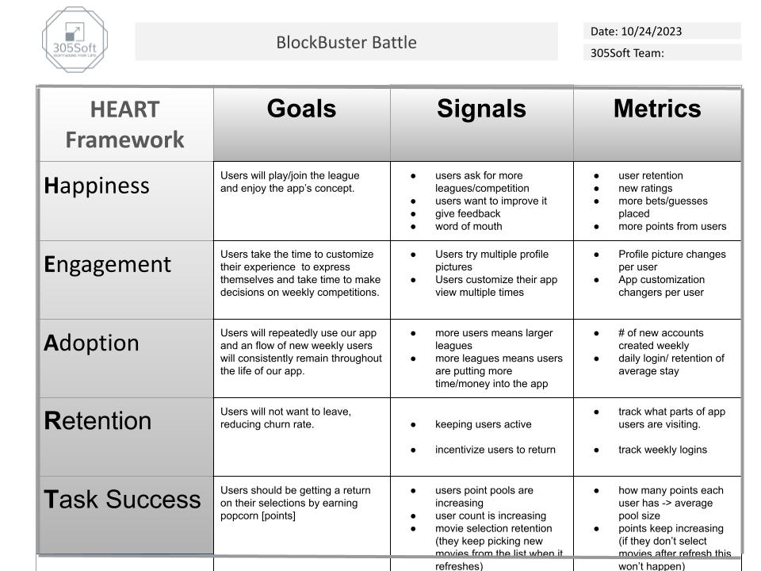

# Engagement metrics: 
  - We would track the amount of times the average user changes their profile picture and customizes their app view. Through those numbers we would be able to show that our users are engaging with all of our additional features in the app.
